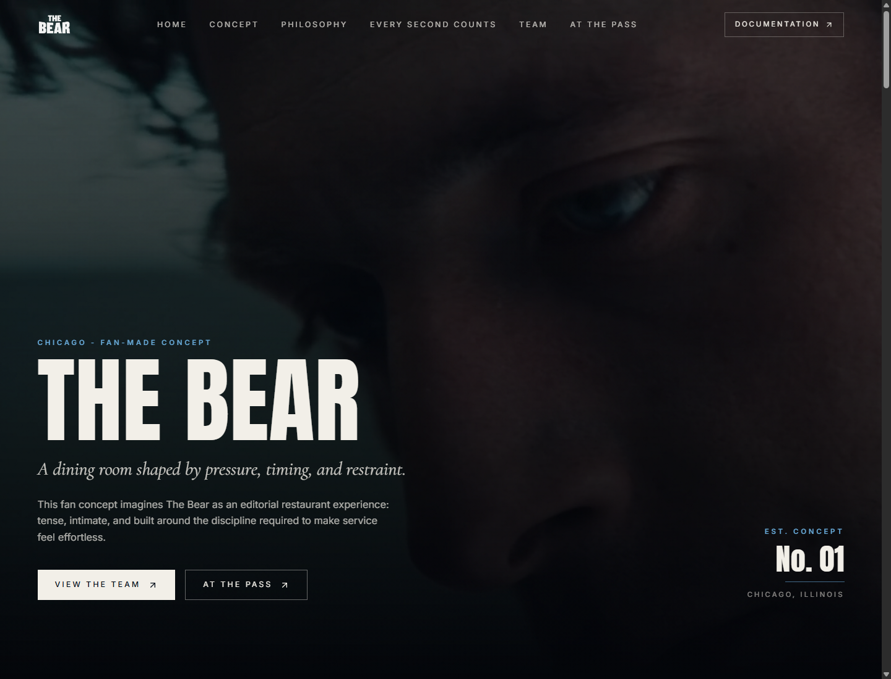
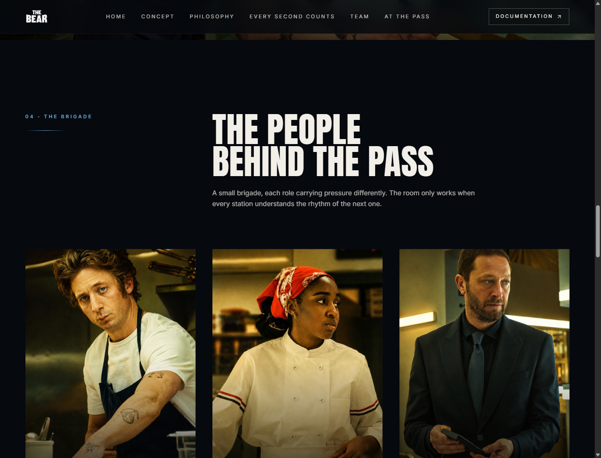
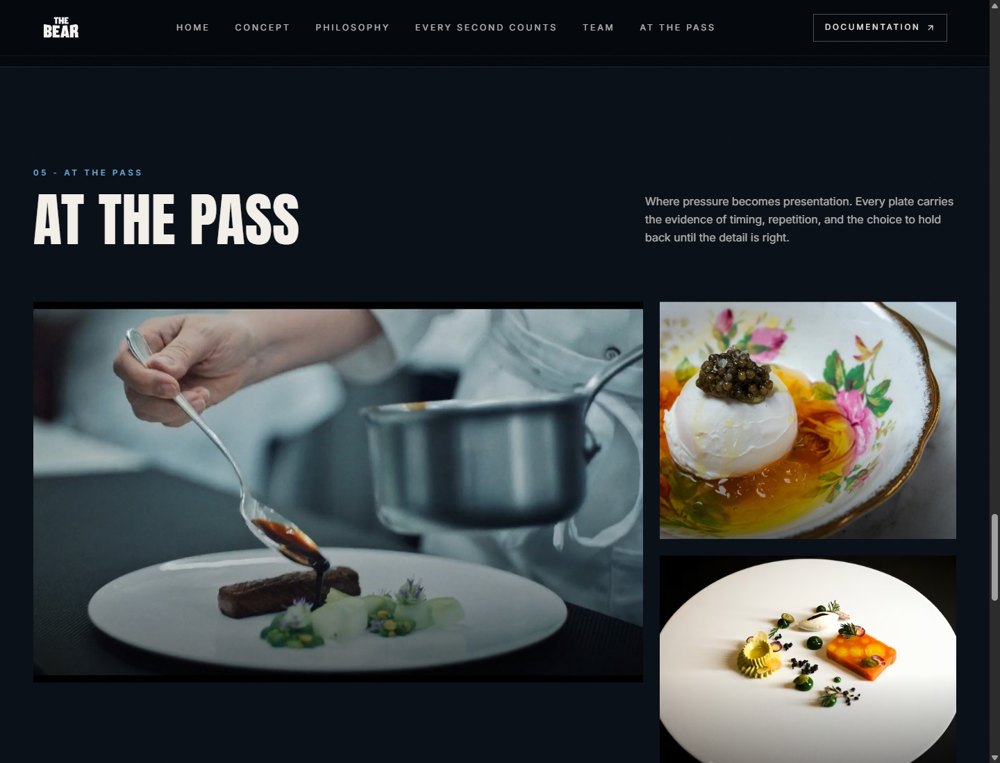

# The Bear - Restaurant Fan Concept

<p align="center">
  
</p>

<p align="center">
  A cinematic fan-made restaurant landing page inspired by the visual world of <strong>The Bear</strong>, built as a José Ferreira/Sick Code portfolio piece.
</p>

<p align="center">
  <strong>React</strong> | <strong>TypeScript</strong> | <strong>TanStack Start</strong> | <strong>Vite</strong> | <strong>Tailwind CSS</strong>
</p>

## Overview

This project imagines The Bear as a premium Chicago restaurant web experience: editorial, restrained, tense, and built around timing. The page uses local cinematic media, scroll-based motion, a dark design system, and carefully structured sections for concept, standards, team, gallery, documentation, and portfolio credit.

It is an unofficial fan concept created to demonstrate frontend craft, visual direction, responsive layout, performance-minded media handling, and immersive brand storytelling.

## Screenshots

| The Brigade                                                                    | At the Pass                                                                          |
| ------------------------------------------------------------------------------ | ------------------------------------------------------------------------------------ |
|  |  |

## Highlights

- Cinematic full-screen hero with local video background.
- Editorial dark interface with custom design tokens.
- Responsive desktop and mobile navigation.
- Scroll reveal animations with reduced-motion fallback.
- Team section with optimized portrait media.
- Dish-focused visual gallery.
- Documentation modal describing the concept, technical choices, and visual direction.
- Local static assets, with the large hero MP4 tracked through Git LFS.
- Footer credit for José Ferreira/Sick Code with an external portfolio link.

## Performance Notes

Desktop media was resized and recompressed for faster loading:

- Team portraits reduced from large source JPEGs to 960px-wide optimized images.
- Gallery images reduced to practical display widths instead of shipping oversized originals.
- The hero poster and logo are preloaded.
- Important above-the-fold and near-fold images use explicit loading priority.
- Scroll reveal now triggers earlier so desktop users do not see empty media blocks while scrolling.
- The 100MB+ hero video remains in Git LFS to stay compatible with GitHub file limits.

## Tech Stack

| Area      | Tools                                     |
| --------- | ----------------------------------------- |
| Framework | React 19, TanStack Start, TanStack Router |
| Language  | TypeScript                                |
| Styling   | Tailwind CSS, custom CSS tokens           |
| Build     | Vite                                      |
| Icons     | Lucide React                              |
| Media     | Local public assets, Git LFS for video    |
| Quality   | ESLint, production Vite build             |

## Local Development

Install dependencies:

```bash
npm install
```

Run the development server:

```bash
npm run dev
```

Build for production:

```bash
npm run build
```

Preview the production build:

```bash
npm run preview
```

The dev server usually runs at:

```text
http://localhost:5173
```

If the port is already in use, Vite prints the active local URL in the terminal.

## Git LFS

The hero video is stored with Git LFS because it is larger than GitHub's regular file limit.

```bash
git lfs install
git lfs pull
```

## Project Structure

```text
.
|-- docs/screenshots       # README screenshots
|-- public/assets          # Local images, logo, and hero video
|-- src/components         # Reusable UI and documentation modal
|-- src/hooks              # Scroll reveal behavior
|-- src/lib                # Shared utilities and error reporting
|-- src/routes             # TanStack route files and main landing page
|-- src/styles.css         # Tailwind entry, design tokens, custom utilities
|-- vite.config.ts         # Vite and TanStack Start config
`-- package.json
```

## Quality Checks

Validated locally with:

```bash
npm run build
npm run lint
```

Current lint status: 0 errors. The remaining warnings are Fast Refresh warnings from reusable UI component files.

## Repository

- GitHub: [realjoseferreira/the-bear-restaurant](https://github.com/realjoseferreira/the-bear-restaurant)
- Default branch: `main`

## Disclaimer

This is an unofficial fan-made concept created for portfolio and design demonstration purposes only. This project is not affiliated with FX, Hulu, Disney, or the official The Bear production.

## Developed By

Developed by [José Ferreira/Sick Code](https://www.sickcode.com.br).
